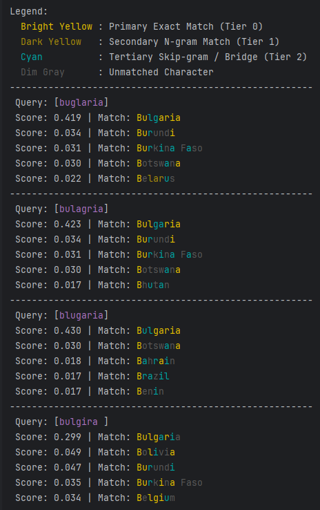

# Typeahead KMP

A high-performance, asynchronous, and lock-free in-memory fuzzy search engine designed specifically for Kotlin
Multiplatform (KMP).

Unlike standard search algorithms that fail during real-time typing, `typeahead-kmp` is built to understand the **"Blind
Continuation" phenomenon**—where users make an early typo but intuitively continue typing the rest of the word
correctly.

Powered by a custom **L2-Normalized Sparse Vector Space** algorithm and immutable state management, it acts as a highly
optimized, local vector database. It provides `O(1)` lookup times while gracefully handling skipped characters, swapped
letters, and phonetic typos, yielding a Cosine Similarity score between `0.0` and `1.0`.

---

## Features

* **Zero Network Latency:** Runs entirely on the Edge (the user's device memory), making it perfect for instant UI
  feedback.
* **Typo & Transposition Tolerant:** N-gram and positional embedding techniques catch mistakes that break standard
  prefix searches.
* **100% Thread-Safe & Lock-Free:** Built on `MutableStateFlow` and `PersistentMap` (HAMT), allowing thousands of
  concurrent reads and writes without blocking threads.
* **Cold-Start Elimination:** Blazing-fast export and import of pre-computed vector states via JSON serialization.
* **Cross-Platform:** Write once, run anywhere across JVM, iOS, Android, JS, and Wasm.

---

## Installation

Add the dependency to your `build.gradle.kts` in the `commonMain` source set:

```kotlin
kotlin {
    sourceSets {
        commonMain.dependencies {
            implementation("io.github.karloti:typeahead-kmp:1.5.0")  // Replace it with the latest version
        }
    }
}
```

## Quick Start

### 1. Initialization and Indexing

You can initialize the engine and populate it with your dataset asynchronously:

```kotlin
data class Country(val id: Int, val countryName: String)

val searchEngine = TypeaheadSearchEngine(textSelector = Country::countryName)

// Add a single item dynamically
searchEngine.add(Country(id = 999, countryName = "Bulgaria"))

// Add multiple items in bulk (highly optimized)
searchEngine.addAll(listOfCountries)
```

### 2. Searching with Highlights

Retrieve matches along with a character-level heatmap for UI highlighting:

```kotlin
val results = searchEngine.findWithHighlights("buglaria", maxResults = 5)

results.forEach { highlightedMatch ->
    val highlightedText = highlightedMatch.heatmap
        .renderHighlightedString(text = highlightedMatch.item.countryName)
    // Format score to 4 decimal places for clean UI alignment
    val formattedScore = highlightedMatch.score.toString().take(5)
    println(" Score: $formattedScore | Match: $highlightedText")
}
```



**Visualizing the Heatmap**: The heatmap array maps each character to a visual tier (e.g., exact match, skipped, wrong),
allowing you to build beautiful, intuitive UI highlights like the one below:

### 3. Exporting & Importing State (Eliminating Cold Starts)

Avoid recalculating vectors on the client device by pre-computing them on your backend or during the build process, then
shipping a static JSON file.

### Exporting:

```kotlin
val fileWriter = File("vectors.json").bufferedWriter()
searchEngine.exportToSequence().forEach { record ->
    val jsonLine = myJsonSerializer.toJson(record)
    fileWriter.write(jsonLine + "\n")
}
fileWriter.close()
```

### Importing (Instant Restore):

```kotlin
// Restore the engine instantly without recalculating vectors
val sequenceOfRecords = File("vectors.json").useLines { lines ->
    lines.map { myJsonSerializer.fromJson<TypeaheadRecord<City>>(it) }
}
searchEngine.importFromSequence(sequenceOfRecords)
```
## Real-World Typing Simulation: The "Cnada" Problem

To truly understand the power of `typeahead-kmp`, let's look at a real-time keystroke simulation.
Imagine a user is trying to type **"Canada"**, but they accidentally type **"Cnada"** (a classic transposition error).

Here is how the engine's internal mathematical weighting dynamically reacts at each keystroke in `O(1)` time:

### Step 1: Initial Input (L2 Normalization & Short-Word Bias)
At this early stage, the user types `C` and then `Cn`. The `P0` (First Letter) anchor heavily restricts the search space. Because the input is extremely short, **L2 Normalization** naturally favors shorter words (Short-Word Bias). This brings 4-letter countries like `Cuba` and `Chad` to the top. By the second keystroke, `Canada` barely enters the top 5.

```lua
=== Typing: 'C' with typing error of 'Cnada' ===
1. Cuba - Score: 0.19181583900475285
2. Chad - Score: 0.19181583900475285
3. China - Score: 0.14776063566992276
4. Chile - Score: 0.14776063566992276
5. Cyprus - Score: 0.11811359847672041

=== Typing: 'Cn' with typing error of 'Cnada' ===
1. Cuba - Score: 0.10297213760008117
2. Chad - Score: 0.10297213760008117
...
5. Canada - Score: 0.07255630308706752
```

### Step 2: Transposition Recovery (Fuzzy Prefix)
The user meant `Can` but typed `Cna`. A strict-prefix algorithm would drop "Canada" entirely at this exact moment. Our **Fuzzy Prefix** dynamically anchors the first letter (`C`) and alphabetically sorts the remaining characters (`a`, `n`). Both the input `Cna` and the target `Can` generate the exact same spatial feature (`FPR_c_an`). `Canada` instantly rockets to the #1 spot!

```lua
=== Typing: 'Cna' with typing error of 'Cnada' ===
1. Canada - Score: 0.14257617990546595 <-- Rockets to #1 via Fuzzy Prefix intersection!
2. Chad - Score: 0.08281542504942256
3. Cuba - Score: 0.07409801188632545
4. China - Score: 0.06757216102651037
5. Chile - Score: 0.05707958943854292
```

### Step 3: Spellchecker Takeover (Typoglycemia Gestalt)
The user types `d`. The engine momentarily switches from "Typeahead Mode" to "Spellchecker Mode" via the **Typoglycemia Gestalt Anchor**. It detects a 4-letter word starting with `C` and ending with `d`. The algorithm mathematically assumes the user is actively trying to spell `Chad` and applies a massive 15.0 spatial intersection multiplier to that specific vector, temporarily overtaking `Canada`.

```lua
=== Typing: 'Cnad' with typing error of 'Cnada' ===
1. Chad - Score: 0.1853988462303561 <-- Massive spike due to Gestalt anchor (C...d)!
2. Canada - Score: 0.1278792484954006
3. Cuba - Score: 0.07957032027053908
4. China - Score: 0.04934251382749997
5. Chile - Score: 0.04168063279838507
```

### Step 4: Final Resolution (Skip-Grams & N-Grams)
The final `a` is typed (length 5). The Gestalt anchor for `Chad` (length 4) completely breaks. The engine reverts to deep structural analysis. Overlapping Skip-Grams seamlessly bridge the transposed letters (`C-n-a-d-a`). This structural skeleton perfectly aligns with the core features of `Canada`, accumulating a massive dot-product score that completely overcomes the length penalty. `Canada` firmly reclaims the #1 spot!

```lua
=== Typing: 'Cnada' with typing error of 'Cnada' ===
1. Canada - Score: 0.2563201621199545 <-- Reclaims the lead via deep structural sequence momentum!
2. China - Score: 0.10623856459894943
3. Chad - Score: 0.05424611768613351
4. Grenada - Score: 0.04955129623022677
5. Chile - Score: 0.047217139821755294
```

**This dynamic, keystroke-by-keystroke shifting between prefix-matching, gestalt spellchecking, and sequence momentum—all happening in `O(1)` time without memory allocations—is what makes `typeahead-kmp` uniquely powerful for human-driven inputs.**


_This dynamic, keystroke-by-keystroke shifting between prefix-matching, gestalt spellchecking, and sequence momentum—all
happening without memory allocations—is what makes this engine uniquely powerful._

## The Evolution: Why standard algorithms fail

Building a perfect typeahead engine is notoriously difficult. During the development of this library, we evaluated and
discarded several standard approaches because they fundamentally misalign with human typing behavior.

## The Problem with Server-Side Giants (Algolia, Typesense)

While engines like **Algolia** and **Typesense** are industry standards for massive databases, they require network
requests. In mobile or web front-ends, **network latency kills the instant "typeahead" feel**. `typeahead-kmp` brings
vector-search intelligence directly to the client.

## The Problem with Traditional Algorithms & Math
Building a perfect typeahead engine requires balancing real-time UI performance with human typing psychology. During the development of this library, we evaluated, implemented, and ultimately discarded several standard algorithmic approaches because they fundamentally misalign with the constraints of mobile environments or human behavior.

- **Levenshtein Distance & Edit-Distance Math**: Traditional fuzzy search algorithms operate with `O(N*M)` time complexity. Running this across thousands of records on every single keystroke quickly blocks the Main UI thread on mobile devices, causing frame drops and stuttering. Furthermore, they heavily penalize length and fail at "Blind Continuation" (where an early typo derails the entire score).

- **Weighted Longest Common Subsequence (LCS)**: While applying index-based positional weights to an LCS algorithm improves accuracy for scattered keystrokes, it still suffers from the same `O(N*M)` CPU bottleneck and requires complex backtracking that is too slow for 60fps keystroke rendering.

- **Strict Prefix Tries / Radix Trees**: Extremely fast (`O(L)` where L is query length) and memory-efficient, but offer absolutely zero typo tolerance. A single transposed character instantly shatters the search tree.

- **In-Memory Dense Vector Databases**: Using traditional dense embeddings (like standard AI vector DBs) provides excellent fuzzy matching, but the memory footprint is massive. Furthermore, inserting and updating full dense vectors is computationally expensive and slow, making them overkill for syntactic typeahead.

`typeahead-kmp` solves this by bridging the gap. By mathematically tokenizing strings into **L2-normalized sparse vectors** upfront (using parallel primitive arrays), it acts as a highly optimized, local feature-store. At search time, it uses a linear `O(K)` two-pointer dot-product intersection. This completely bypasses heavy floating-point divisions and recursive matrix calculations during the critical search loop, delivering `O(1)` relative lookup performance with a fraction of the memory overhead.

## Algorithm Comparison

| Algorithm | Typo Tolerance | Prefix Anchor | Memory Cost | Blind Continuation | Search Complexity |
| :--- | :---: | :---: | :---: | :---: | :---: |
| **Strict Prefix Tries** | ❌ None | ✅ Perfect | ✅ Low | ❌ Fails | `O(L)` |
| **Levenshtein Distance** | ✅ Good | ❌ Poor | ✅ Low | ❌ Poor | `O(N*M)` |
| **Weighted LCS** | ✅ Good | ⚠️ Moderate | ⚠️ Medium | ⚠️ Moderate | `O(N*M)` |
| **Dense Vector DBs** | ✅ Excellent | ❌ Poor | ❌ Massive | ✅ Excellent | `O(log N)` |
| **Standard N-Grams** | ✅ Good | ❌ Poor | ⚠️ High | ✅ Good | `O(1)` |
| **Typeahead KMP (Ours)**| **✅ Excellent**| **✅ Excellent** | **✅ Low (Sparse)**| **✅ Excellent** | **`O(K)` ~ `O(1)`** |


_(Note: K represents the number of non-zero overlapping features, which is strictly bounded by the string length, rendering the search time effectively O(1) relative to the total dataset size)._

---

## Performance & Architecture

The engine is engineered for environments with strict memory and CPU constraints:

- **Memory Efficiency**: Uses primitive parallel arrays (`FloatArray` and `IntArray`) internally instead of object
  wrappers, cutting memory footprint by more than 50%.

- **Top-K Retrieval**: Built on top of a custom `BoundedConcurrentPriorityQueue` that discards low-priority matches
  instantly without allocation.

- **Concurrency**: Uses a Compare-And-Swap (CAS) approach via `MutableStateFlow` and Kotlin's `PersistentMap`. This
  ensures that even if you hammer the engine with 10,000 concurrent `.add()` operations, no data is lost and the thread
  is never blocked.

## Performance, Memory & Cold-Start Elimination

To demonstrate the engine's efficiency under heavy loads, we run an aggressive benchmark indexing **10,000 complex product records** (resulting in an 84 MB JSON export).

Because string tokenization and mathematical L2-normalization are computationally heavy, the initial insertion takes some CPU time and memory. However, **importing pre-computed vectors bypasses all mathematical operations**, resulting in a near-instant cold-start with virtually zero memory bloat.

## Benchmark Output (JVM):

```lua
================================================================================
PERFORMANCE SUMMARY (10,000 Records)
================================================================================
Insertion:        419 ms | Memory: 114 MB  <-- Heavy mathematical tokenization
Export:           7 ms   | Memory: 1 MB    <-- Instant state read via PersistentMap
Serialization:    432 ms 
File Write:       117 ms | Disk: 84 MB
File Read:        108 ms
Deserialization:  428 ms | Memory: 192 MB
Import (Restore): 9 ms   | Memory: 5 MB    <-- Bypasses math; instant state hydration!
================================================================================
Total Time:       1520 ms
================================================================================
✅ Import verification completed successfully - all results are identical!
```
### Key Takeaways:

- **Zero-Cost Reads**: Exporting the current state takes only `7 ms` because the internal `PersistentMap` allows instant iteration without locking the data structure.

- **Lightning-Fast Hydration**: Restoring 10,000 records takes only `9 ms` and `5 MB` of RAM. By generating the JSON index on your backend or during CI/CD, you can ship it to mobile clients for instant search availability on app launch.

---

## Tracking & Roadmap
We use YouTrack for task management and issue tracking.
You can view the current tasks and progress here:
[Typeahead KMP Issues & Roadmap](https://smartcoding.youtrack.cloud/projects/typeahead_kmp)

## License
This project is licensed under the **Apache License Version 2.0** - see the [LICENSE](LICENSE) file for details.