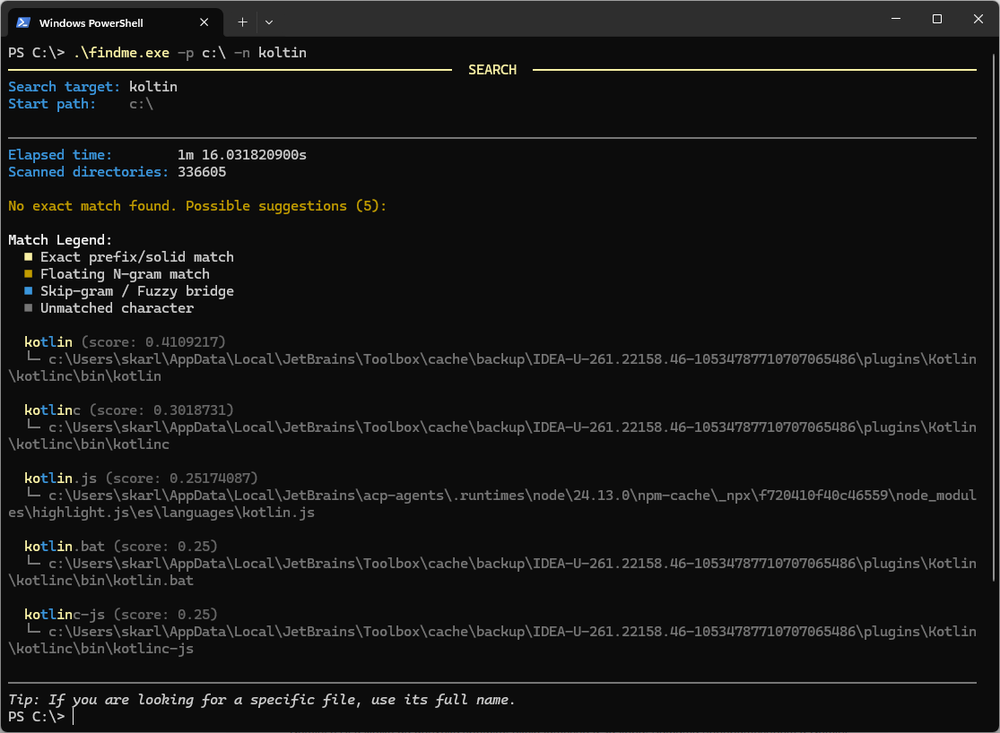

# Typeahead KMP

A high-performance, asynchronous, and lock-free in-memory fuzzy search engine designed specifically for Kotlin
Multiplatform (KMP).

Unlike standard search algorithms that fail during real-time typing, `typeahead-kmp` is built to understand the **"Blind
Continuation" phenomenon**—where users make an early typo but intuitively continue typing the rest of the word
correctly.

Powered by a custom **L2-Normalized Sparse Vector Space** algorithm and immutable state management, it acts as a highly
optimized, local vector database. It provides `O(1)` lookup times while gracefully handling skipped characters, swapped
letters, and phonetic typos, yielding a Cosine Similarity score between `0.0` and `1.0`.

---

## Features

* **Zero Network Latency:** Runs entirely on the Edge (the user's device memory), making it perfect for instant UI
  feedback.
* **Typo & Transposition Tolerant:** N-gram and positional embedding techniques catch mistakes that break standard
  prefix searches.
* **100% Thread-Safe & Lock-Free:** Built on `MutableStateFlow` and `PersistentMap` (HAMT), allowing thousands of
  concurrent reads and writes without blocking threads.
* **Cold-Start Elimination:** Blazing-fast export and import of pre-computed vector states via JSON serialization.
* **Cross-Platform:** Write once, run anywhere across JVM, iOS, Android, JS, and Wasm.

---

## Installation

Add the dependency to your `build.gradle.kts` in the `commonMain` source set:

```kotlin
kotlin {
    sourceSets {
        commonMain.dependencies {
            implementation("io.github.karloti:typeahead-kmp:1.5.0")  // Replace it with the latest version
        }
    }
}
```

## Supported Platforms

`typeahead-kmp` is fully written in pure Kotlin with absolutely no platform-specific dependencies (like Foundation on iOS or java.util on JVM for its core logic). This allows it to be compiled and executed seamlessly across all major Kotlin Multiplatform targets:

| Category | Platform | Supported KMP Targets |
| :--- | :--- | :--- |
| **Mobile** | Android | `androidTarget` |
| **Mobile** | iOS | `iosX64`, `iosArm64`, `iosSimulatorArm64` |
| **Desktop & Server** | JVM | `jvm` |
| **Desktop & Server** | macOS | `macosX64`, `macosArm64` |
| **Desktop & Server** | Linux | `linuxX64`, `linuxArm64` |
| **Desktop & Server** | Windows | `mingwX64` |
| **Web** | JavaScript | `js` (with IR compiler) |
| **Web** | WebAssembly | `wasmJs` |

Because the engine manages its own memory efficiently via primitive arrays and lock-free concurrency, you will get the exact same deterministic search results and blazing-fast performance regardless of the platform you compile for.

## Quick Start

### 1. Initialization and Indexing

You can initialize the engine and populate it with your dataset asynchronously:

```kotlin
data class Country(val id: Int, val countryName: String)

val searchEngine = TypeaheadSearchEngine(textSelector = Country::countryName)

// Add a single item dynamically
searchEngine.add(Country(id = 999, countryName = "Bulgaria"))

// Add multiple items in bulk (highly optimized)
searchEngine.addAll(listOfCountries)
```

### 2. Searching with Highlights

Retrieve matches along with a character-level heatmap for UI highlighting:

```kotlin
val results = searchEngine.findWithHighlights("buglaria", maxResults = 5)

results.forEach { (country, score, heatmap) ->
    val highlightedText = heatmap.renderHighlightedString(country.countryName)
    val formattedScore = score.toString().take(5)
    println(" Score: $formattedScore | Match: $highlightedText")
}
```


**Visualizing the Heatmap**: The heatmap array maps each character to a visual tier (e.g., exact match, skipped, wrong),
allowing you to build beautiful, intuitive UI highlights like the one below:

### 3. Exporting & Importing State (Eliminating Cold Starts)

Avoid recalculating vectors on the client device by pre-computing them on your backend or during the build process, then
shipping a static JSON file.

### Exporting:

```kotlin
import kotlinx.serialization.encodeToString
import kotlinx.serialization.json.Json
import java.io.File

// 1. Export the engine's internal state to a list
val exportedRecords = searchEngine.exportAsSequence().toList()

// 2. Serialize the records to a JSON string using kotlinx.serialization
val jsonString = Json.encodeToString(exportedRecords)

// 3. Write the JSON directly to a file
File("typeahead_vectors.json").writeText(jsonString)
```

### Importing (Instant Restore):

```kotlin
import kotlinx.serialization.decodeFromString
import kotlinx.serialization.json.Json
import io.github.karloti.typeahead.TypeaheadRecord
import java.io.File

// 1. Read the JSON string from the file
val jsonFromFile = File("typeahead_vectors.json").readText()

// 2. Deserialize the JSON back into a List of TypeaheadRecord objects
val deserializedRecords = Json.decodeFromString<List<TypeaheadRecord<City>>>(jsonFromFile)

// 3. Restore the engine instantly without recalculating mathematical vectors
searchEngine.importFromSequence(deserializedRecords.asSequence())
```

## Real-World Typing Simulation: The "Cnada" Problem

To truly understand the power of `typeahead-kmp`, let's look at a real-time keystroke simulation.
Imagine a user is trying to type **"Canada"**, but they accidentally type **"Cnada"** (a classic transposition error).

Here is how the engine's internal mathematical weighting dynamically reacts at each keystroke in `O(1)` time:

### Step 1: Initial Input (L2 Normalization & Short-Word Bias)

At this early stage, the user types `C` and then `Cn`. The `P0` (First Letter) anchor heavily restricts the search
space. Because the input is extremely short, **L2 Normalization** naturally favors shorter words (Short-Word Bias). This
brings 4-letter countries like `Cuba` and `Chad` to the top. By the second keystroke, `Canada` barely enters the top 5.

```lua
=== Typing: 'C' with typing error of 'Cnada' ===
1. Cuba - Score: 0.19181583900475285
2. Chad - Score: 0.19181583900475285
3. China - Score: 0.14776063566992276
4. Chile - Score: 0.14776063566992276
5. Cyprus - Score: 0.11811359847672041

=== Typing: 'Cn' with typing error of 'Cnada' ===
1. Cuba - Score: 0.10297213760008117
2. Chad - Score: 0.10297213760008117
...
5. Canada - Score: 0.07255630308706752
```

### Step 2: Transposition Recovery (Fuzzy Prefix)

The user meant `Can` but typed `Cna`. A strict-prefix algorithm would drop "Canada" entirely at this exact moment. Our *
*Fuzzy Prefix** dynamically anchors the first letter (`C`) and alphabetically sorts the remaining characters (`a`, `n`).
Both the input `Cna` and the target `Can` generate the exact same spatial feature (`FPR_c_an`). `Canada` instantly
rockets to the #1 spot!

```lua
=== Typing: 'Cna' with typing error of 'Cnada' ===
1. Canada - Score: 0.14257617990546595 <-- Rockets to #1 via Fuzzy Prefix intersection!
2. Chad - Score: 0.08281542504942256
3. Cuba - Score: 0.07409801188632545
4. China - Score: 0.06757216102651037
5. Chile - Score: 0.05707958943854292
```

### Step 3: Spellchecker Takeover (Typoglycemia Gestalt)

The user types `d`. The engine momentarily switches from "Typeahead Mode" to "Spellchecker Mode" via the **Typoglycemia
Gestalt Anchor**. It detects a 4-letter word starting with `C` and ending with `d`. The algorithm mathematically assumes
the user is actively trying to spell `Chad` and applies a massive 15.0 spatial intersection multiplier to that specific
vector, temporarily overtaking `Canada`.

```lua
=== Typing: 'Cnad' with typing error of 'Cnada' ===
1. Chad - Score: 0.1853988462303561 <-- Massive spike due to Gestalt anchor (C...d)!
2. Canada - Score: 0.1278792484954006
3. Cuba - Score: 0.07957032027053908
4. China - Score: 0.04934251382749997
5. Chile - Score: 0.04168063279838507
```

### Step 4: Final Resolution (Skip-Grams & N-Grams)

The final `a` is typed (length 5). The Gestalt anchor for `Chad` (length 4) completely breaks. The engine reverts to
deep structural analysis. Overlapping Skip-Grams seamlessly bridge the transposed letters (`C-n-a-d-a`). This structural
skeleton perfectly aligns with the core features of `Canada`, accumulating a massive dot-product score that completely
overcomes the length penalty. `Canada` firmly reclaims the #1 spot!

```lua
=== Typing: 'Cnada' with typing error of 'Cnada' ===
1. Canada - Score: 0.2563201621199545 <-- Reclaims the lead via deep structural sequence momentum!
2. China - Score: 0.10623856459894943
3. Chad - Score: 0.05424611768613351
4. Grenada - Score: 0.04955129623022677
5. Chile - Score: 0.047217139821755294
```

**This dynamic, keystroke-by-keystroke shifting between prefix-matching, gestalt spellchecking, and sequence
momentum—all happening in `O(1)` time without memory allocations—is what makes `typeahead-kmp` uniquely powerful for
human-driven inputs.**


_This dynamic, keystroke-by-keystroke shifting between prefix-matching, gestalt spellchecking, and sequence momentum—all
happening without memory allocations—is what makes this engine uniquely powerful._

## Beyond UI: CLI Fuzzy File Finder

While `typeahead-kmp` is heavily optimized for real-time mobile and web UIs, its underlying L2-normalized sparse vector
engine is highly versatile and can be applied to backend utilities and Command Line Interfaces (CLIs).

Included in the repository is a practical example of a **CLI Fuzzy File Search**. When navigating deeply nested
directory structures, it is incredibly common to mistype a filename. Instead of a frustrating "File not found" error,
this tool leverages the typeahead engine to act as a resilient safety net, instantly suggesting the closest possible
matches.



### How It Works

1. **Recursive Indexing**: The script recursively traverses the local file system (skipping hidden directories like
   `.git`), feeding file names into the `TypeaheadSearchEngine` while storing their absolute paths as the associated
   payload.
2. **Intelligent Fallback**: The CLI first checks for an exact match. If the user makes a typo (e.g., typing `Typeahed`
   instead of `Typeahead`), the exact search fails, and the engine immediately falls back to its vector space search to
   find the nearest neighbors.
3. **Visual Heatmap Highlighting**: This example showcases the true power of the engine's `findWithHighlights()` API.
   Instead of just returning a score, the engine returns an `IntArray` spatial heatmap for each match. The CLI uses this
   data to render color-coded terminal output:

* 🟩 **Solid Prefix**: Exact starting matches.
* 🟨 **Floating N-Gram**: Contiguous blocks of characters found in the middle of the word.
* 🟦 **Skip-Gram**: Scattered, individual character matches (the "fuzzy bridge").
* ⬜ **Unmatched**: Characters that were skipped or mistyped.

This demonstrates how the internal scoring mechanism can be directly piped into UI rendering logic—whether that's a
terminal output or styled text in Jetpack Compose / SwiftUI.

## The Evolution: Why standard algorithms fail

Building a perfect typeahead engine is notoriously difficult. During the development of this library, we evaluated and
discarded several standard approaches because they fundamentally misalign with human typing behavior.

## The Problem with Server-Side Giants (Algolia, Typesense)

While engines like **Algolia** and **Typesense** are industry standards for massive databases, they require network
requests. In mobile or web front-ends, **network latency kills the instant "typeahead" feel**. `typeahead-kmp` brings
vector-search intelligence directly to the client.

## The Problem with Traditional Algorithms

Building a perfect typeahead engine requires balancing real-time UI performance with human typing psychology. During the
development of this library, we evaluated, implemented, and ultimately discarded several standard algorithmic approaches
because they fundamentally misalign with the constraints of mobile environments (60fps UI rendering, memory
fragmentation, Garbage Collection pauses) or human behavior.

- **Strict Prefix Tries / Radix Trees**: Extremely fast (`O(L)` where L is query length) and highly memory-efficient.
  However, they offer absolutely zero typo tolerance. A single transposed or missed character instantly shatters the
  search path, frustrating users who type quickly on glass screens.

- **Levenshtein & Damerau-Levenshtein Distance**: The industry standard for spelling correction. Unfortunately, these
  operate with `O(N*M)` time complexity via dynamic programming matrices. Running this math across thousands of records
  on every single keystroke quickly blocks the Main UI thread on mobile devices, causing frame drops and stuttering.
  Furthermore, they heavily penalize string length differences and fail completely at the "Blind Continuation"
  phenomenon (where an early typo derails the entire score, even if the rest of the word is typed perfectly).

- **Jaro-Winkler Similarity**: Specifically designed to give heavy weight to matching prefixes, making it seemingly
  ideal for autocomplete. However, it still suffers from `O(N*M)` CPU bottlenecks. More importantly, its strict prefix
  anchor means that if the user makes a mistake in the very first or second character, the similarity score degrades
  drastically, destroying the typeahead experience.

- **Weighted Longest Common Subsequence (LCS)**: While applying index-based positional weights to an LCS algorithm
  improves accuracy for scattered keystrokes and dropped characters, it still requires complex matrix backtracking. This
  mathematical overhead is simply too slow for asynchronous, per-keystroke rendering.

- **Standard N-Grams & Jaccard / Cosine Sets**: Breaking strings into overlapping chunks (N-grams) solves the typo and
  transposition problems beautifully. However, traditional implementations rely heavily on creating massive amounts of
  intermediate `String` objects or `Set` collections. On mobile (JVM/ART or Kotlin Native), this triggers aggressive
  Garbage Collection (GC) pauses, leading to UI jitter. Additionally, standard sets treat words as bags-of-tokens,
  completely losing the critical "Prefix Anchor" (the fact that the beginning of a word matters more than the end).

- **Ratcliff-Obershelp & SIFT4**: While experimental algorithms like SIFT4 simulate human perception and operate in
  linear time (`O(max(N,M))`), they lack the structural optimizations required for concurrent environments. They don't
  natively integrate with lock-free data structures, making them difficult to scale across highly concurrent
  reader/writer coroutines without blocking.

- **In-Memory Dense Vector Databases**: Using traditional dense embeddings (like standard AI vector DBs) provides
  excellent semantic and fuzzy matching (`O(log N)` search times). However, the memory footprint is massive. Inserting,
  updating, and holding full dense vectors in RAM is computationally expensive and battery-draining, making them
  absolute overkill for purely syntactic typeahead.

### The Solution: Typeahead KMP

To solve these compounding issues, `typeahead-kmp` abandons traditional string-to-string comparisons during the search
phase.

Instead, it functions as a highly specialized, local vector database:

1. **Zero-Allocation Math**: We use an **L2-Normalized Sparse Vector Space**. Vectors are represented by parallel,
   primitive `FloatArray` structures, strictly halving memory footprints and completely eliminating object fragmentation
   and GC pauses.
2. **`O(K)` Search Complexity**: Because vectors are pre-computed and alphabetically sorted, the core search reduces to
   an ultra-fast, two-pointer dot-product intersection.
3. **Lock-Free Concurrency**: Utilizing immutable state (`PersistentMap`) and atomic Compare-And-Swap (CAS) operations
   via a custom `BoundedConcurrentPriorityQueue`, the engine handles thousands of parallel reads and writes without ever
   locking a thread.
4. **Human-Centric Scoring**: By combining positional weighting (P0 Anchors) with N-gram tokenization, the engine
   seamlessly handles typos, transpositions, and the "Blind Continuation" effect, dynamically yielding a precise Cosine
   Similarity score (`0.0` to `1.0`) in milliseconds.

## Algorithm Comparison

| Algorithm                            | Typo Tolerance  |  Prefix Anchor  |    Memory Cost     | Blind Continuation |  Search Complexity  |
|:-------------------------------------|:---------------:|:---------------:|:------------------:|:------------------:|:-------------------:|
| **Strict Prefix Tries**              |     ❌ None      |    ✅ Perfect    |       ✅ Low        |      ❌ Fails       |       `O(L)`        |
| **Levenshtein Distance**             |     ✅ Good      |     ❌ Poor      |       ✅ Low        |       ❌ Poor       |      `O(N*M)`       |
| **Weighted & Damerau-Levenshtein**   |   ✅ Excellent   |     ❌ Poor      |     ⚠️ Medium      |       ❌ Poor       |      `O(N*M)`       |
| **Jaro-Winkler**                     |     ✅ Good      |   ✅ Excellent   |       ✅ Low        |       ❌ Poor       |      `O(N*M)`       |
| **Longest Common Subsequence (LCS)** |     ✅ Good      |   ⚠️ Moderate   |     ⚠️ Medium      |    ⚠️ Moderate     |      `O(N*M)`       |
| **Standard N-Grams & Q-Grams**       |     ✅ Good      |     ❌ Poor      |      ⚠️ High       |       ✅ Good       |      `O(N+M)`       |
| **Cosine / Jaccard / Dice (Sets)**   |     ✅ Good      |     ❌ Poor      |      ⚠️ High       |       ✅ Good       |      `O(N+M)`       |
| **Ratcliff-Obershelp**               |   ⚠️ Moderate   |     ❌ Poor      |     ⚠️ Medium      |    ⚠️ Moderate     | `O(N³)` ~ `O(N*M)`  |
| **SIFT4 (Experimental)**             |   ✅ Excellent   |   ⚠️ Moderate   |       ✅ Low        |       ✅ Good       |    `O(max(N,M))`    |
| **Dense Vector DBs**                 |   ✅ Excellent   |     ❌ Poor      |     ❌ Massive      |    ✅ Excellent     |     `O(log N)`      |
| **Typeahead KMP (Ours)**             | **✅ Excellent** | **✅ Excellent** | **✅ Low (Sparse)** |  **✅ Excellent**   | **`O(K)` ~ `O(1)`** |

_(Note: K represents the number of non-zero overlapping features, which is strictly bounded by the string length,
rendering the search time effectively O(1) relative to the total dataset size)._

---

## Performance & Architecture

The engine is engineered for environments with strict memory and CPU constraints:

- **Memory Efficiency**: Uses primitive parallel arrays (`FloatArray` and `IntArray`) internally instead of object
  wrappers, cutting memory footprint by more than 50%.

- **Top-K Retrieval**: Built on top of a custom `BoundedConcurrentPriorityQueue` that discards low-priority matches
  instantly without allocation.

- **Concurrency**: Uses a Compare-And-Swap (CAS) approach via `MutableStateFlow` and Kotlin's `PersistentMap`. This
  ensures that even if you hammer the engine with 10,000 concurrent `.add()` operations, no data is lost and the thread
  is never blocked.

## Performance, Memory & Cold-Start Elimination

To demonstrate the engine's efficiency under heavy loads, we run an aggressive benchmark indexing **10,000 complex
product records** (resulting in an 84 MB JSON export).

Because string tokenization and mathematical L2-normalization are computationally heavy, the initial insertion takes
some CPU time and memory. However, **importing pre-computed vectors bypasses all mathematical operations**, resulting in
a near-instant cold-start with virtually zero memory bloat.

## Benchmark Output (JVM):

```lua
================================================================================
PERFORMANCE SUMMARY (10,000 Records)
================================================================================
Insertion:        419 ms | Memory: 114 MB  <-- Heavy mathematical tokenization
Export:           7 ms   | Memory: 1 MB    <-- Instant state read via PersistentMap
Serialization:    432 ms 
File Write:       117 ms | Disk: 84 MB
File Read:        108 ms
Deserialization:  428 ms | Memory: 192 MB
Import (Restore): 9 ms   | Memory: 5 MB    <-- Bypasses math; instant state hydration!
================================================================================
Total Time:       1520 ms
================================================================================
✅ Import verification completed successfully - all results are identical!
```

### Key Takeaways:

- **Zero-Cost Reads**: Exporting the current state takes only `7 ms` because the internal `PersistentMap` allows instant
  iteration without locking the data structure.

- **Lightning-Fast Hydration**: Restoring 10,000 records takes only `9 ms` and `5 MB` of RAM. By generating the JSON
  index on your backend or during CI/CD, you can ship it to mobile clients for instant search availability on app
  launch.

---

## Tracking & Roadmap

We use YouTrack for task management and issue tracking.
You can view the current tasks and progress here:
[Typeahead KMP Issues & Roadmap](https://smartcoding.youtrack.cloud/projects/typeahead_kmp)

## License

This project is licensed under the **Apache License Version 2.0** - see the [LICENSE](LICENSE) file for details.